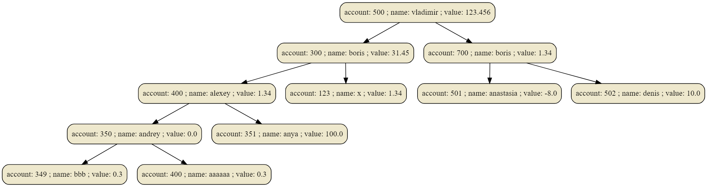

# A simple in memory database
[K-d tree](https://en.wikipedia.org/wiki/K-d_tree) is the best data structure for this task since we need to use the least space and find at log(n) time. We could construct a hash table for each field to find at constant time, but that would take more space.

